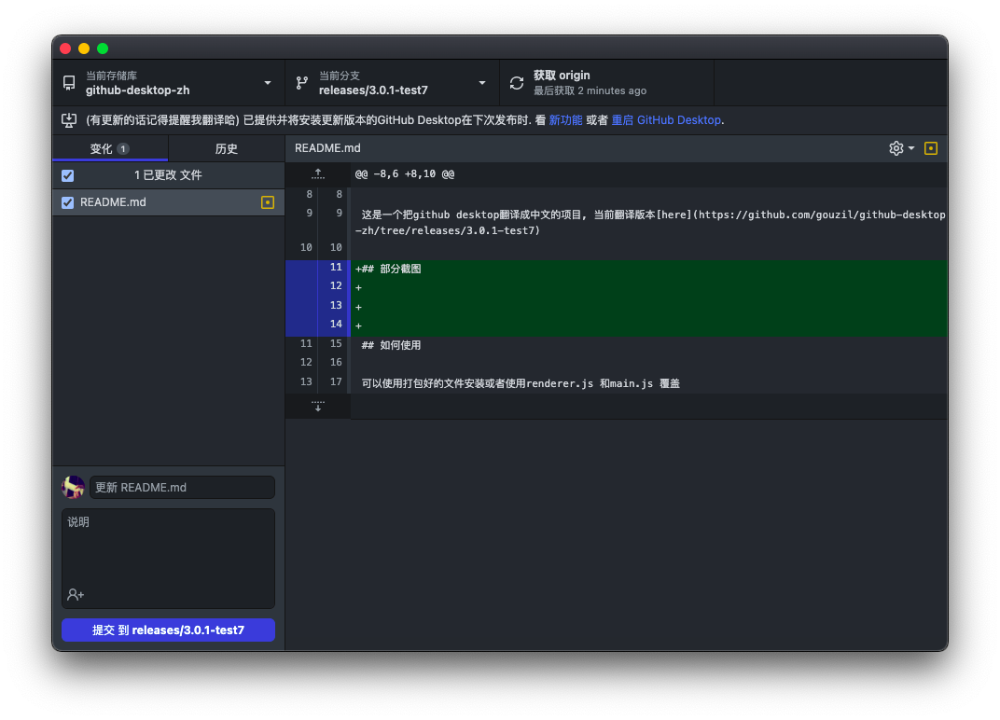
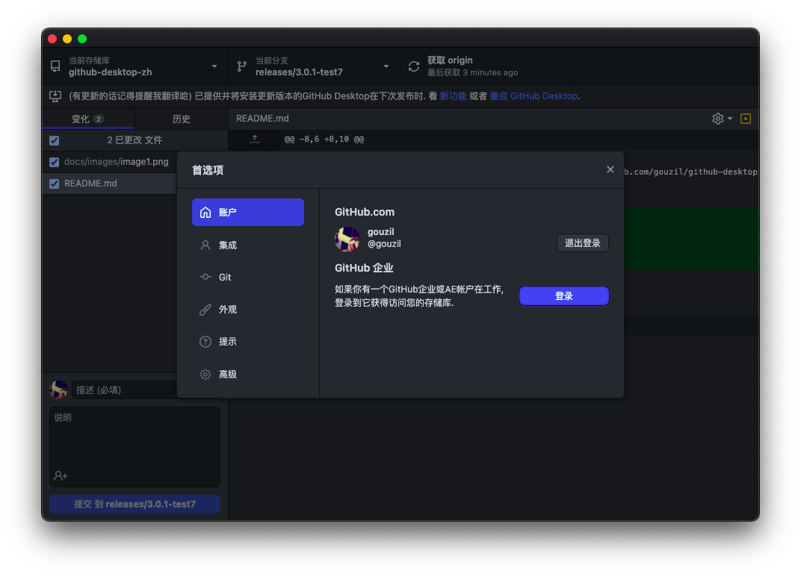
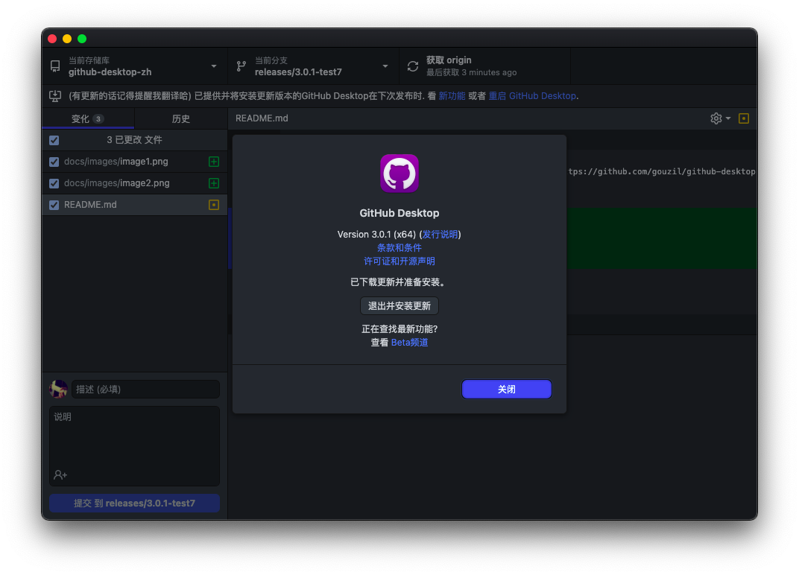

<p align="center">
 
 <h2 align="center">GitHub Desktop</h2>
</p>
  <p align="center">
    <a href="https://github.com/gouzil/github-desktop-zh/actions">
      
    </a>
    <a href="https://github.com/gouzil/github-desktop-zh/issues">
      
    </a>
    <a href="https://github.com/gouzil/github-desktop-zh/pulls">
      
    </a>
    <a href="https://github.com/gouzil/github-desktop-zh/releases/tag/version-release-3.0.8">
      
    </a>
  </p>

原版 [README.md](./Original-README-EN.md)

中文版 [README.md](./Original-README-ZH.md)

## 这是一个什么项目？

这是一个把github desktop翻译成中文的项目, 当前翻译版本[release-3.1.1](https://github.com/gouzil/github-desktop-zh/tree/release-3.1.1)

## 部分截图





## 如何使用

可以使用打包好的文件安装或者使用renderer.js 和main.js 覆盖

注意:备份自己的renderer.js main.js (替换回来如果还是报错重新安装就行)

目录:
```bash
/Applications/GitHub Desktop.app/Contents/Resources/app
```

## 遇到问题？

翻译后出现的问题请在: [issues](https://github.com/gouzil/github-desktop-zh/issues) 提出

原版问题请在: [issues](https://github.com/desktop/desktop/issues) 提出

## 致谢

非常感谢原版开发者们

<a href="https://github.com/wechaty/python-wechaty/graphs/contributors">
  
</a>

## 最后

<font color="red"> 请不要售卖 </font>
<font color="red"> 请不要售卖 </font>
<font color="red"> 请不要售卖 </font>

如果发现售卖请在[issues](https://github.com/gouzil/github-desktop-zh/issues)提出
